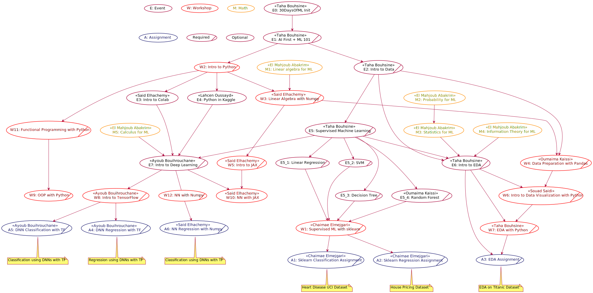
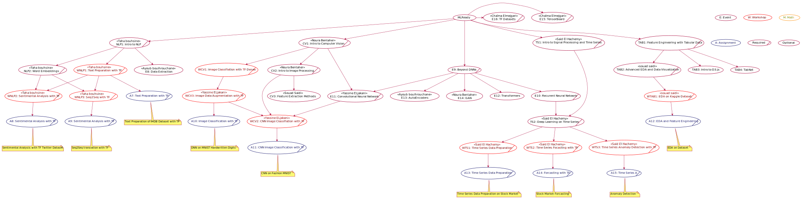

# #30DaysOfML

Welcome to the @GDSCUIZ & @TFUGAgadir 30 Days of Machine Learning Collaboration.

This is a series of events fully in Moroccan Darija, the main goal of it is to create ML practitioners out of our attendees, and prepare them to become certified TensorFlow Developers.

## TL:DR

### Prequetise

**None**, just a Kaggle account and a will to learn.

### Plan

1. MLStart
1. MLReady
1. MLInnovate
1. MLDeploy
1. MLOlympiads

### What you will take

- Python
- Machine Learning
- TensorFlow
- Sklearn
- More Python
 - Pandas
 - Numpy
 - Matplotlib and Seaborn
 - JAX
- Community Support

### What you will do
- Attend Sessions
- Finish Assignments
- Pass the exams to receive your TensorFlow Certificate voucher (worth 100$) 

> Vouchers are limited to the first 20 persons to pass the exams, the rest will be provided with a 50% discount stipend.

### Who is eligible to join
Anyone willing to become a Machine learning expert is welcome to join

### What's next

All attendees will get the chance to take part in the ongoing #MLOlympiads organized by TFUGAgadir.

## Planning

## #MLStart

## #MLReady

## References
- A Complete Machine Learning Package by Jean de Dieu Nyandwi https://devlibrary.withgoogle.com/products/ml/repos/Nyandwi-machine_learning_complete
- Teaching Data Science by Yogesh H Kulkarni https://github.com/yogeshhk/TeachingDataScience