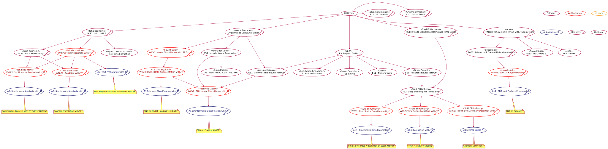

# Events List
## Table of Contents
- [Events List](#events-list)
  - [Table of Contents](#table-of-contents)
  - [#MLStart](#mlstart)
    - [Events](#events)
      - [E0: **30DaysOfML init**](#e0-30daysofml-init)
      - [E1: **AI 101**](#e1-ai-101)
      - [E2: **Intro to Data**](#e2-intro-to-data)
      - [E3: **Intro to Colab**](#e3-intro-to-colab)
      - [E4: **Python in Kaggle**](#e4-python-in-kaggle)
      - [E5: **Supervised Machine Learning**](#e5-supervised-machine-learning)
      - [E6: **Intro to EDA**](#e6-intro-to-eda)
      - [E7: **Intro to Deep Learning**](#e7-intro-to-deep-learning)
    - [Workshops](#workshops)
      - [W1: **Supervised ML with sklearn**](#w1-supervised-ml-with-sklearn)
      - [W2: **Intro to Python**](#w2-intro-to-python)
      - [W4: **Data Preparation with Pandas**](#w4-data-preparation-with-pandas)
      - [W5: **Intro to JAX**](#w5-intro-to-jax)
      - [W6: **Intro to Data Visualization with Python**](#w6-intro-to-data-visualization-with-python)
      - [W7: **EDA with Python**](#w7-eda-with-python)
      - [W8: **Intro to TensorFlow**](#w8-intro-to-tensorflow)
      - [W9: **OOP with Python**](#w9-oop-with-python)
      - [W10: **NN with JAX**](#w10-nn-with-jax)
      - [W11: **Functional Programming with Python **](#w11-functional-programming-with-python-)
    - [Assignments](#assignments)
      - [A1: **Sklearn Classification Assignment**](#a1-sklearn-classification-assignment)
      - [A2: **Sklearn Regression Assignment**](#a2-sklearn-regression-assignment)
      - [A3: **EDA Assignment**](#a3-eda-assignment)
      - [A4: **DNN Regression with TF**](#a4-dnn-regression-with-tf)
      - [A5: **DNN Classification with TF**](#a5-dnn-classification-with-tf)
      - [A6: **NN Regression with Numpy**](#a6-nn-regression-with-numpy)
    - [Math For ML](#math-for-ml)
      - [M1: **Linear algebra for ML**](#m1-linear-algebra-for-ml)
      - [M2: **Probability for ML**](#m2-probability-for-ml)
      - [M3: **Statistics for ML**](#m3-statistics-for-ml)
      - [M5: **Calculus for ML**](#m5-calculus-for-ml)
      - [M4: **Information Theory for ML**](#m4-information-theory-for-ml)
  - [#MLReady](#mlready)
  - [#MLInnovate](#mlinnovate)
  - [#MLDeploy](#mldeploy)
  - [#MLOlympiad](#mlolympiad)

## #MLStart

---
### Events

#### E0: **30DaysOfML init**

Speaker: **Taha Bouhsine** @skywolfmo 

Date: 12/02/2022 19:30 -> 20:30

Goals: 

  - Explain the events planning
  - Assignments
  - TF Certificate Voucher
  - MLOlympiads

---
#### E1: **AI 101**

Speaker: **Taha Bouhsine** @skywolfmo 

Date: 13/02/2022 19:30 -> 20:30

Goals: 

  - Introduce AI
  - AI Possible Solutions
  - Types of AI
  - Classical Methods vs AI
  - Teachable Machine
  - What is Machine Learning?
  - Types of Machine Learning

---
#### E2: **Intro to Data**

Speaker: **Noura Bentaher** @nourabentaher 

Date: 14/02/2022 

Goals: 

  - What is Data
  - Types of Data
  - Data in the jungle
  - Importance of Data
  - Challenges of Data

---
#### E3: **Intro to Colab**

Speaker: **Said Elhachemy** @SaidElhachemy 

Date: 16/02/2022

Goals: 

  - Using Colab with Python
  - Why you should use it?
  - Loading Data from Drive
  - Downloading Data from colab

---
#### E4: **Python in Kaggle**

Speaker: **Lahcen Ousayd** @Ous_Lah 

Date: 15/02/2022

Goals:

  - What is Kaggle
    - Kaggle Competitions
    - Kaggle Datasets
    - Kaggle Notebooks

---
#### E5: **Supervised Machine Learning**

Speaker: **Lahcen Ousayd** @ouslah 

Date: 16/02/2022

Goals: 

  - Metrics
  - Linear Regression
  - SVM
  - Decision Tree
  - Ensemble
  - Model Evaluation

---
#### E6: **Intro to EDA**

Speaker: **Souad Saidi** @SouadSaidi 

Date: 18/02/2022

Goals: 

  - Data Scientist Role
  - Data Problems
  - Importance of Clean Data
  - Hidden Relations
  - Important Charts

---
#### E7: **Intro to Deep Learning**

Speaker: **Ayoub Bouihrouchane** @ayoubbouih 

Date: 17/02/2022

Goals: 

  - Intro to Neural Networks
  - Non-linear relations and NNs
  - Forward-propagations
  - Back-propagation

---
### Workshops

#### W1: **Supervised ML with sklearn**

Speaker: **Chaima Elmejgari** @ChaimaElmejgari 

Date: 18/02/2022

Goals: 

  - Implementing different ML models with sklearn
  - Evaluating the model
  - Ploting the history

---
#### W2: **Intro to Python** 
Speaker: **El Bachir Outidrarine** @ElBachirOutidrarine 

Date: 14/02/2022

Goals: 

  - The Python way

---
#### W4: **Data Preparation with Pandas**
 
Speaker: **Oumaima Kaissi** @oumakai 

Date: 16/02/2022

Goals: 

  - Load Data with Pandas
  - Clean Data
  - Dataframe methods
  - Data manipulation
  - Data merge

---
#### W5: **Intro to JAX**

Speaker: **Said Elhachemy** @saidelhachemy 

Date: 17/02/2022

Goals: 

  - JAX basics
  - JAX Numpy Basics

---
#### W6: **Intro to Data Visualization with Python**
Speaker: **Souad Saidi** @souadsaidi 

Date: 18/02/2022

Goals: 

  - Data Visualization
  - Chart Types
  - Important Charts
  - Color choice
  - Metadata

---
#### W7: **EDA with Python**

Speaker: **Taha Bouhsine** @skywolfmo 

Date: 22/02/2022

Goals: 

  - Hands-on a Kaggle Dataset
  - Cleaning Data
  - Ask Questions
  - Plot Data
  - Look for Answers

---
#### W8: **Intro to TensorFlow**
Speaker: **Ayoub Bouihrouchane** @ayoubbouih 

Date: 21/02/2022

Goals: 

  - Loading Data
  - Implementing DNNs with TensorFlow
  - Plotting history
  - Evaluating the Model

---

#### W9: **OOP with Python** 
Speaker: **El Bachir Outidrarine** @ElBachirOutidrarine 

Date: 21/02/2022

Goals: 

  - OOP
  - OOP in Python

---

#### W10: **NN with JAX**

Speaker: **Said Elhachemy** @SaidElhachemy 

Date: 22/02/2022

Goals: 

  - What is Data

---
#### W11: **Functional Programming with Python **

Speaker: **El Bachir Outidrarine** @ElBachirOutidrarine 

Date: 15/02/2022

Goals: 

  - Functional Programming

---
### Assignments

#### A1: **Sklearn Classification Assignment**
Manager: **Chaima Elmejgari** @ChaimaElmejgari 

Deadline: 31/02/2022

Description: 

  - Titanic Classification with sklearn

Link: 

---
#### A2: **Sklearn Regression Assignment**

Manager: **Chaima Elmejgari** @ChaimaElmejgari 

Deadline: 31/02/2022

Description:

Link:

---
#### A3: **EDA Assignment** 
Manager: **Taha Bouhsine** @skywolfmo 

Deadline: 31/02/2022

Description:

Link:

---
#### A4: **DNN Regression with TF** 
Manager: **Ayoub Bouihrouchane** @ayoubbouih 

Deadline: 31/02/2022

Description:

Link:

---
#### A5: **DNN Classification with TF**
Manager: **Ayoub Bouihrouchane** @ayoubbouih 

Deadline: 31/02/2022

Description:

Link:

---
#### A6: **NN Regression with Numpy** 
Manager: **Said Elhachemy** @SaidElhachemy 

Deadline: 31/02/2022

Description:

Link:

---
### Math For ML
Speaker: **El Mahjoub Abakrim** @ElMahjoubAbakrim 

#### M1: **Linear algebra for ML**

Date: 14/02/2022

Goals: 

  - Linear Algebra basics

---
#### M2: **Probability for ML**

Date: 16/02/2022

Goals: 

  - Probability Basics

---
#### M3: **Statistics for ML**

Date: 16/02/2022

Goals: 

  - Statistics Basics

---
#### M5: **Calculus for ML**  
Date: 15/02/2022

Goals: 

  - Partial derivative
  - Integrals

---
#### M4: **Information Theory for ML** 
Date: 17/02/2022

Goals: 

  - What is Entropy?
  - What is Encoding?

---
## #MLReady
SVG RAW is Clickable

---
## #MLInnovate
<!-- TODO -->

---
## #MLDeploy
<!-- TODO -->

---
## #MLOlympiad
<!-- TODO -->
