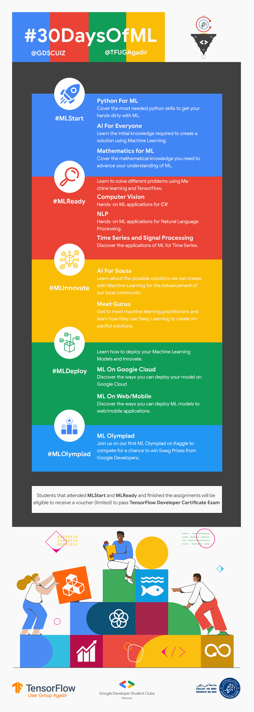
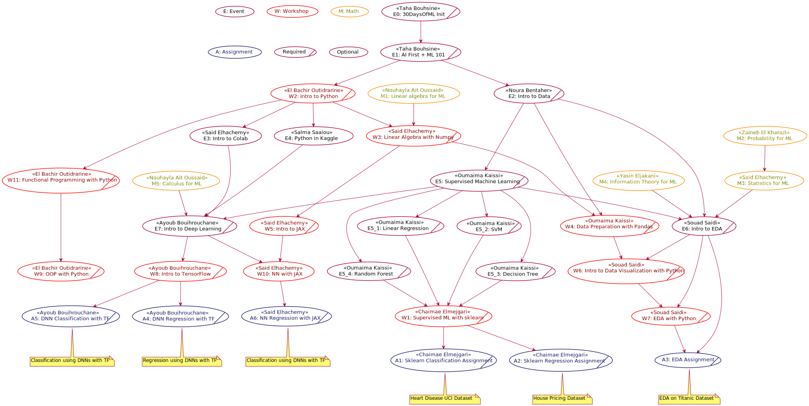
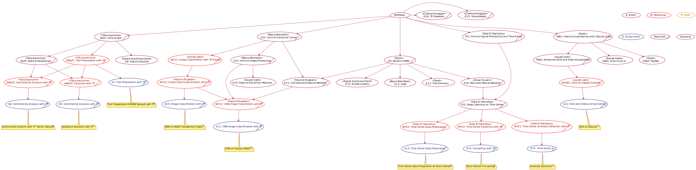

# #30DaysOfML

Welcome to the [@GDSCUIZ](https://gdsc.community.dev/university-of-ibn-zohr/) & [@TFUGAgadir](https://www.meetup.com/TFUGAgadir), [30 Days of Machine Learning](https://gdscuiz.github.io/30daysofml).

One of the hurdles that hiders self-learners is the language barrier. Instead of focusing on understanding the knowledge required, the learners put great effort into just understanding a single sentence of what's been explained.

For the goal of breaking this barrier and helping in enforcing the Democratization of Artificial Intelligence, we, [@GDSCUIZ](https://gdsc.community.dev/university-of-ibn-zohr/) and [@TFUGAgadir](https://www.meetup.com/TFUGAgadir), ought to create this series of events fully presented in Moroccan Darija, to introduce our attendees to the general concepts needed to solve problems using Machine Learning.

At the end of the [#30DaysOfML](https://gdscuiz.github.io/30daysofml), our attendees will have a certificate indicating the number of events they did attend. And the attendees that finish all the assignments will be offered the [TensorFlow Developer Certificate](https://www.tensorflow.org/certificate) Voucher to pass the exam.

This [**#30DaysOfML**](https://gdscuiz.github.io/30daysofml) is split into 5 phases.

The first phase, [**#MLStart**](https://gdscuiz.github.io/30daysofml/events/mlstart), introduce the attendees to the basics needed to get started with creating solutions using Machine Learning.

The second phase, [**#MLReady**](https://gdscuiz.github.io/30daysofml/events/mlready), will get into more details about the application of machine learning in NLP, Computer Vision, and Time Series with TensorFlow.

After attending the [**#MLStart**](https://gdscuiz.github.io/30daysofml/events/mlstart) and [**#MLReady**](https://gdscuiz.github.io/30daysofml/events/mlready) and finishing the assignments before the deadline, students will be eligible to receive a voucher to pass the TensorFlow Certificate Program exam (Limited Number, Sponsored by [**Google Developers**]()).

Then the [**#MLDeploy**](https://gdscuiz.github.io/30daysofml/events/mldeploy) will focus more on Machine Learning models deployment in the Google and TensorFlow ecosystem.

Then the [**#MLInnovate**](https://gdscuiz.github.io/30daysofml/events/mlinnovate), where we will host Machine Learning practitioners to learn how they use ML to create impactful solutions.

Lastly, as part of the [**#30DaysOfML**](https://gdscuiz.github.io/30daysofml), we did launch the [**#MLOlympiad**](https://gdscuiz.github.io/30daysofml/events/mlolympiad) Kaggle competition, where participants try to create Machine Learning models to **classify** whether a genome sequence belongs to **Humans** or **Gorillas**. 

> The top 3 teams will receive swag prizes sponsored by **Google Developers**.

You can join the training by registering and joining our [@GDSCUIZ](https://gdsc.community.dev/university-of-ibn-zohr/) chapter from [here](https://gdsc.community.dev/university-of-ibn-zohr/), or by joining [@TFUGAgadir](https://www.meetup.com/TFUGAgadir) on meetup from this [link](https://www.meetup.com/TFUGAgadir).

## Table of Contents
- [#30DaysOfML](#30daysofml)
  - [Table of Contents](#table-of-contents)
  - [TL:DR](#tldr)
    - [Prequetise](#prequetise)
    - [Plan](#plan)
    - [How to join?](#how-to-join)
    - [Event List](#event-list)
    - [What you will take](#what-you-will-take)
    - [What you will do](#what-you-will-do)
    - [Who is eligible to join](#who-is-eligible-to-join)
    - [What's next](#whats-next)
    - [Program Managers](#program-managers)
  - [Planning](#planning)
    - [#MLStart](#mlstart)
    - [#MLReady](#mlready)
    - [#MLInnovate](#mlinnovate)
    - [#MLDeploy](#mldeploy)
    - [#MLOlympiad](#mlolympiad)

## TL:DR

### Prequetise

**None**, just a Kaggle account and a will to learn.

### Plan

### How to join?

You can join the training by registering and joining our [@GDSCUIZ](https://gdsc.community.dev/university-of-ibn-zohr/) chapter from [here](https://gdsc.community.dev/university-of-ibn-zohr/), or by joining [@TFUGAgadir](https://www.meetup.com/TFUGAgadir) on meetup from this [link](https://www.meetup.com/TFUGAgadir).

### Event List

You can find the event list [here](https://gdscuiz.github.io/30daysofml/events_list/), as well as the links of events.

### What you will take

- Python
- Machine Learning
- TensorFlow
- Sklearn
- More Python
 - Pandas
 - Numpy
 - Matplotlib and Seaborn
 - JAX
- Community Support

### What you will do
- Attend Sessions
- Finish Assignments
- Pass the exams to receive your TensorFlow Certificate voucher (worth 100$) 

> Vouchers are limited to the first people that pass the exams.

### Who is eligible to join
Anyone willing to become a Machine learning expert is welcome to join

### What's next

All attendees will get the chance to take part in the ongoing [#MLOlympiad](https://www.kaggle.com/c/ml-olympiad-gdscuiz-and-tfugagadir) organized by [@TFUGAgadir](https://www.meetup.com/TFUGAgadir).

### Program Managers
If you face any problem or have any question feel free to contact the program managers.

**Managers:**

- 30DaysOfML Manager: **Taha Bouhsine**  @skywolfmo ***contact@tahabouhsine.me***

- MLStart Manager: **Ayoub Bouihrouchane** @ayoubbouih

- MLReady Manager: **Noura Bentaher** @nourabentaher

- MLInnovate Manager: **Said El Hachemy** @saidelhachemy

- MLDeploy Manager: **Abdelfettah Hilmi** @abdelfettahhilmi

- MLOlympiad Manager: 
    - **Said El Hachemy**
    - **Taha Bouhsine**
    - **Lahcen Oussayd**

## Planning

### #MLStart
All the basics you need to create solutions using Machine learning.

[Learn more!](http://gdscuiz.github.io/30daysofml/events/mlstart/)

### #MLReady

[Learn more!](http://gdscuiz.github.io/30daysofml/events/mlready/)

### #MLInnovate

Meet machine learning gurus and learn how they apply machine learning to create impactful solutions.

[Learn more!](http://gdscuiz.github.io/30daysofml/events/mlready/)

### #MLDeploy
learn about hte challenges, tools and technologies used to deploy machine learning models with Google technologies.

[Learn more!](http://gdscuiz.github.io/30daysofml/events/mlready/)

### #MLOlympiad

Build a genome sequences classifier to predict whether a sequence belong to a human or to a gorilla.

[Learn more!](https://www.kaggle.com/c/ml-olympiad-gdscuiz-and-tfugagadir)
